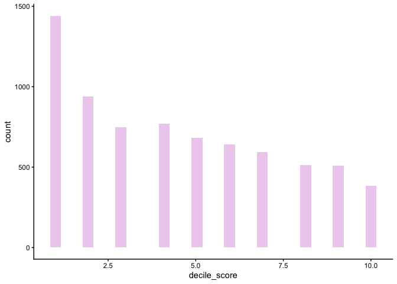
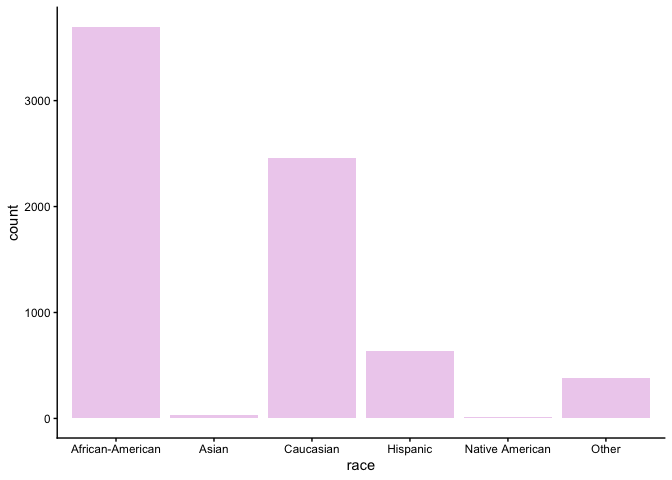
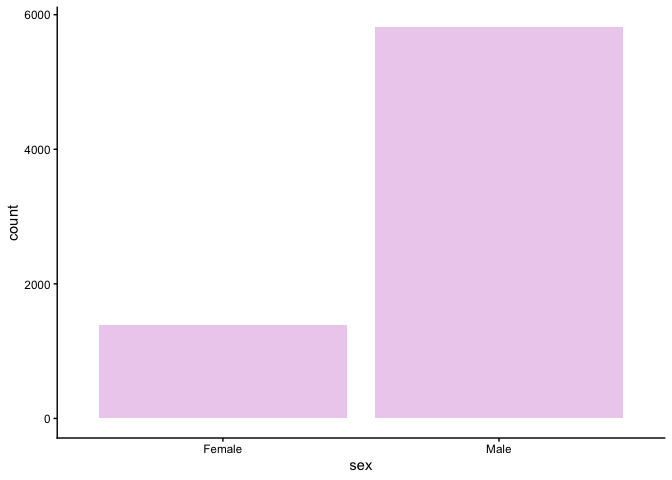
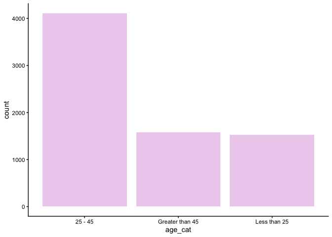
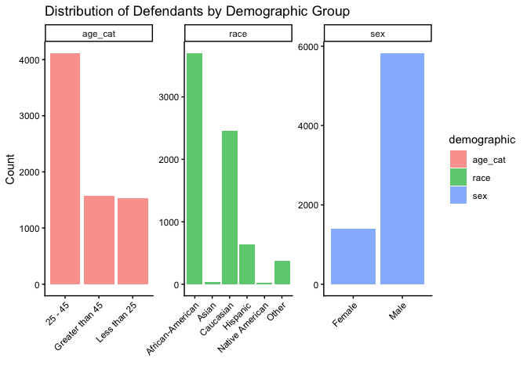
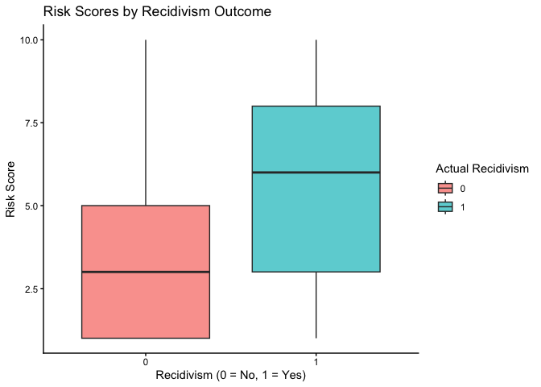
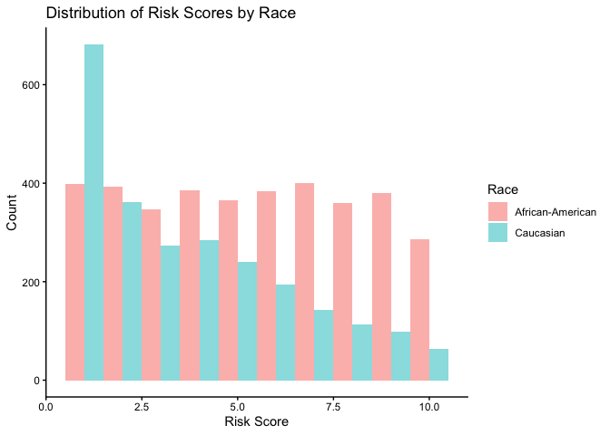

Lab 09: Algorithmic Bias
================
Anaelle Gackiere
03-20-2026

## Load Packages and Data

First, let’s load the necessary packages:

``` r
library(tidyverse)
library(fairness)
library(janitor)
```

### The data

For this lab, we’ll use the COMPAS dataset compiled by ProPublica. The
data has been preprocessed and cleaned for you. You’ll have to load it
yourself. The dataset is available in the `data` folder, but I’ve
changed the file name from `compas-scores-two-years.csv` to
`compas-scores-2-years.csv`. I’ve done this help you practice debugging
code when you encounter an error.

``` r
compas <- read_csv("data/compas-scores-2-years.csv") %>%
  clean_names() %>%
  rename(
    decile_score = decile_score_12,
    priors_count = priors_count_15
  )
```

    ## New names:
    ## Rows: 7214 Columns: 53
    ## ── Column specification
    ## ──────────────────────────────────────────────────────── Delimiter: "," chr
    ## (19): name, first, last, sex, age_cat, race, c_case_number, c_charge_de... dbl
    ## (19): id, age, juv_fel_count, decile_score...12, juv_misd_count, juv_ot... lgl
    ## (1): violent_recid dttm (2): c_jail_in, c_jail_out date (12):
    ## compas_screening_date, dob, c_offense_date, c_arrest_date, r_offe...
    ## ℹ Use `spec()` to retrieve the full column specification for this data. ℹ
    ## Specify the column types or set `show_col_types = FALSE` to quiet this message.
    ## • `decile_score` -> `decile_score...12`
    ## • `priors_count` -> `priors_count...15`
    ## • `decile_score` -> `decile_score...40`
    ## • `priors_count` -> `priors_count...49`

``` r
# Take a look at the data
glimpse(compas)
```

    ## Rows: 7,214
    ## Columns: 53
    ## $ id                      <dbl> 1, 3, 4, 5, 6, 7, 8, 9, 10, 13, 14, 15, 16, 18…
    ## $ name                    <chr> "miguel hernandez", "kevon dixon", "ed philo",…
    ## $ first                   <chr> "miguel", "kevon", "ed", "marcu", "bouthy", "m…
    ## $ last                    <chr> "hernandez", "dixon", "philo", "brown", "pierr…
    ## $ compas_screening_date   <date> 2013-08-14, 2013-01-27, 2013-04-14, 2013-01-1…
    ## $ sex                     <chr> "Male", "Male", "Male", "Male", "Male", "Male"…
    ## $ dob                     <date> 1947-04-18, 1982-01-22, 1991-05-14, 1993-01-2…
    ## $ age                     <dbl> 69, 34, 24, 23, 43, 44, 41, 43, 39, 21, 27, 23…
    ## $ age_cat                 <chr> "Greater than 45", "25 - 45", "Less than 25", …
    ## $ race                    <chr> "Other", "African-American", "African-American…
    ## $ juv_fel_count           <dbl> 0, 0, 0, 0, 0, 0, 0, 0, 0, 0, 0, 0, 0, 0, 0, 0…
    ## $ decile_score            <dbl> 1, 3, 4, 8, 1, 1, 6, 4, 1, 3, 4, 6, 1, 4, 1, 3…
    ## $ juv_misd_count          <dbl> 0, 0, 0, 1, 0, 0, 0, 0, 0, 0, 0, 0, 0, 0, 0, 0…
    ## $ juv_other_count         <dbl> 0, 0, 1, 0, 0, 0, 0, 0, 0, 0, 0, 0, 0, 0, 0, 0…
    ## $ priors_count            <dbl> 0, 0, 4, 1, 2, 0, 14, 3, 0, 1, 0, 3, 0, 0, 1, …
    ## $ days_b_screening_arrest <dbl> -1, -1, -1, NA, NA, 0, -1, -1, -1, 428, -1, 0,…
    ## $ c_jail_in               <dttm> 2013-08-13 06:03:42, 2013-01-26 03:45:27, 201…
    ## $ c_jail_out              <dttm> 2013-08-14 05:41:20, 2013-02-05 05:36:53, 201…
    ## $ c_case_number           <chr> "13011352CF10A", "13001275CF10A", "13005330CF1…
    ## $ c_offense_date          <date> 2013-08-13, 2013-01-26, 2013-04-13, 2013-01-1…
    ## $ c_arrest_date           <date> NA, NA, NA, NA, 2013-01-09, NA, NA, 2013-08-2…
    ## $ c_days_from_compas      <dbl> 1, 1, 1, 1, 76, 0, 1, 1, 1, 308, 1, 0, 0, 1, 4…
    ## $ c_charge_degree         <chr> "F", "F", "F", "F", "F", "M", "F", "F", "M", "…
    ## $ c_charge_desc           <chr> "Aggravated Assault w/Firearm", "Felony Batter…
    ## $ is_recid                <dbl> 0, 1, 1, 0, 0, 0, 1, 0, 0, 1, 0, 1, 0, 0, 1, 1…
    ## $ r_case_number           <chr> NA, "13009779CF10A", "13011511MM10A", NA, NA, …
    ## $ r_charge_degree         <chr> NA, "(F3)", "(M1)", NA, NA, NA, "(F2)", NA, NA…
    ## $ r_days_from_arrest      <dbl> NA, NA, 0, NA, NA, NA, 0, NA, NA, 0, NA, NA, N…
    ## $ r_offense_date          <date> NA, 2013-07-05, 2013-06-16, NA, NA, NA, 2014-…
    ## $ r_charge_desc           <chr> NA, "Felony Battery (Dom Strang)", "Driving Un…
    ## $ r_jail_in               <date> NA, NA, 2013-06-16, NA, NA, NA, 2014-03-31, N…
    ## $ r_jail_out              <date> NA, NA, 2013-06-16, NA, NA, NA, 2014-04-18, N…
    ## $ violent_recid           <lgl> NA, NA, NA, NA, NA, NA, NA, NA, NA, NA, NA, NA…
    ## $ is_violent_recid        <dbl> 0, 1, 0, 0, 0, 0, 0, 0, 0, 1, 0, 0, 0, 0, 0, 0…
    ## $ vr_case_number          <chr> NA, "13009779CF10A", NA, NA, NA, NA, NA, NA, N…
    ## $ vr_charge_degree        <chr> NA, "(F3)", NA, NA, NA, NA, NA, NA, NA, "(F2)"…
    ## $ vr_offense_date         <date> NA, 2013-07-05, NA, NA, NA, NA, NA, NA, NA, 2…
    ## $ vr_charge_desc          <chr> NA, "Felony Battery (Dom Strang)", NA, NA, NA,…
    ## $ type_of_assessment      <chr> "Risk of Recidivism", "Risk of Recidivism", "R…
    ## $ decile_score_40         <dbl> 1, 3, 4, 8, 1, 1, 6, 4, 1, 3, 4, 6, 1, 4, 1, 3…
    ## $ score_text              <chr> "Low", "Low", "Low", "High", "Low", "Low", "Me…
    ## $ screening_date          <date> 2013-08-14, 2013-01-27, 2013-04-14, 2013-01-1…
    ## $ v_type_of_assessment    <chr> "Risk of Violence", "Risk of Violence", "Risk …
    ## $ v_decile_score          <dbl> 1, 1, 3, 6, 1, 1, 2, 3, 1, 5, 4, 4, 1, 2, 1, 2…
    ## $ v_score_text            <chr> "Low", "Low", "Low", "Medium", "Low", "Low", "…
    ## $ v_screening_date        <date> 2013-08-14, 2013-01-27, 2013-04-14, 2013-01-1…
    ## $ in_custody              <date> 2014-07-07, 2013-01-26, 2013-06-16, NA, NA, 2…
    ## $ out_custody             <date> 2014-07-14, 2013-02-05, 2013-06-16, NA, NA, 2…
    ## $ priors_count_49         <dbl> 0, 0, 4, 1, 2, 0, 14, 3, 0, 1, 0, 3, 0, 0, 1, …
    ## $ start                   <dbl> 0, 9, 0, 0, 0, 1, 5, 0, 2, 0, 0, 4, 1, 0, 0, 0…
    ## $ end                     <dbl> 327, 159, 63, 1174, 1102, 853, 40, 265, 747, 4…
    ## $ event                   <dbl> 0, 1, 0, 0, 0, 0, 1, 0, 0, 1, 0, 1, 0, 0, 1, 1…
    ## $ two_year_recid          <dbl> 0, 1, 1, 0, 0, 0, 1, 0, 0, 1, 0, 1, 0, 0, 1, 1…

Part 1

### Exercise 1

What are the dimensions of the COMPAS dataset? (Hint: Use inline R code
and functions like nrow and ncol to compose your answer.) What does each
row in the dataset represent? What are the variables?

Our dataset has`7214` rows and `53` columns. Each row represents one
person (an observation). The variables are
`id, name, first, last, compas_screening_date, sex, dob, age, age_cat, race, juv_fel_count, decile_score, juv_misd_count, juv_other_count, priors_count, days_b_screening_arrest, c_jail_in, c_jail_out, c_case_number, c_offense_date, c_arrest_date, c_days_from_compas, c_charge_degree, c_charge_desc, is_recid, r_case_number, r_charge_degree, r_days_from_arrest, r_offense_date, r_charge_desc, r_jail_in, r_jail_out, violent_recid, is_violent_recid, vr_case_number, vr_charge_degree, vr_offense_date, vr_charge_desc, type_of_assessment, decile_score_40, score_text, screening_date, v_type_of_assessment, v_decile_score, v_score_text, v_screening_date, in_custody, out_custody, priors_count_49, start, end, event, two_year_recid`.

### Exercise 2

Based on the ID variable, there are `7214` unique defendants are in the
dataset, while there are `7214` rows total. This is the same as the
number of rows, but I’m not sure I’m convinced by this method.

So I’ll group by name, and I find that each observation is still unique
and matches the rows, even if the names are shared.

``` r
# See if same name appears with diff IDs
compas %>%
  group_by(name) %>%
  summarise(n_ids = n_distinct(id)) %>%
  filter(n_ids > 1)
```

    ## # A tibble: 55 × 2
    ##    name                 n_ids
    ##    <chr>                <int>
    ##  1 angel santiago           2
    ##  2 anthony gonzalez         2
    ##  3 anthony louis            2
    ##  4 anthony smith            3
    ##  5 brandon whitfield        2
    ##  6 carlos vasquez           2
    ##  7 christopher gonzalez     2
    ##  8 christopher hamilton     2
    ##  9 christopher harris       2
    ## 10 clinton johnson          2
    ## # ℹ 45 more rows

``` r
# some people might share the same name, so I'll double check with DOB
compas %>%
  group_by(name, dob) %>%
  summarise(n_ids = n_distinct(id)) %>%
  filter(n_ids > 1)
```

    ## `summarise()` has regrouped the output.
    ## ℹ Summaries were computed grouped by name and dob.
    ## ℹ Output is grouped by name.
    ## ℹ Use `summarise(.groups = "drop_last")` to silence this message.
    ## ℹ Use `summarise(.by = c(name, dob))` for per-operation grouping
    ##   (`?dplyr::dplyr_by`) instead.

    ## # A tibble: 0 × 3
    ## # Groups:   name [0]
    ## # ℹ 3 variables: name <chr>, dob <date>, n_ids <int>

### Exercise 3

Let’s examine the distribution of the COMPAS risk scores (decile_score)!

The distribution is positively skewed.

``` r
ggplot(compas, aes(x = decile_score)) +
  geom_histogram(alpha = 0.5, fill = "plum") +
  theme_classic()
```

    ## `stat_bin()` using `bins = 30`. Pick better value `binwidth`.

<!-- -->

### Exercise 4

The distribution of defendants by race

``` r
ggplot(compas, aes(x = race)) +
  geom_bar(alpha = 0.5, fill = "plum") +
  theme_classic()
```

<!-- -->

The distribution of defendants by sex

``` r
ggplot(compas, aes(x = sex)) +
  geom_bar(alpha = 0.5, fill = "plum") +
  theme_classic()
```

<!-- -->

The distribution of defendants by age category

``` r
ggplot(compas, aes(x = age_cat)) +
  geom_bar(alpha = 0.5, fill = "plum") +
  theme_classic()
```

<!-- -->

Demographics Distribution

``` r
compas_long <- compas %>%
  select(race, sex, age_cat) %>%
  pivot_longer(cols = everything(), names_to = "demographic", values_to = "value")

ggplot(compas_long, aes(x = value, fill = demographic)) +
  geom_bar(alpha = 0.7) +
  facet_wrap(~ demographic, scales = "free") +
  theme_classic() +
  theme(axis.text.x = element_text(angle = 45, hjust = 1)) +
  labs(title = "Distribution of Defendants by Demographic Group",
       x = "", y = "Count")
```

<!-- -->

Part 2: Risk Scores and Recidivism

### Exercise 5

Create a visualization showing the relationship between risk scores
(decile_score) and actual recidivism (two_year_recid). Do higher risk
scores actually correspond to higher rates of recidivism

``` r
ggplot(compas, aes(x = factor(two_year_recid), y = decile_score, fill = factor(two_year_recid))) +
  geom_boxplot(alpha = 0.7) +
  theme_classic() +
  labs(title = "Risk Scores by Recidivism Outcome",
       x = "Recidivism (0 = No, 1 = Yes)",
       y = "Risk Score",
       fill = "Actual Recidivism")
```

<!-- -->

### Exercise 6

Calculate the overall accuracy of the COMPAS algorithm.

``` r
compas <- compas %>%
  mutate(compas_classification = case_when(
    decile_score >= 7 & two_year_recid == 1 ~ "TP",
    decile_score <= 4 & two_year_recid == 0 ~ "TN",
    decile_score >= 7 & two_year_recid == 0 ~ "FP",
    decile_score <= 4 & two_year_recid == 1 ~ "FN",
    TRUE ~ NA_character_  # scores 5-6 are ambiguous, exclude them
  ))

# accuracy calculation
compas %>%
  filter(!is.na(compas_classification)) %>%
  summarise(
    TP = sum(compas_classification == "TP"),
    TN = sum(compas_classification == "TN"),
    FP = sum(compas_classification == "FP"),
    FN = sum(compas_classification == "FN"),
    accuracy = (TP + TN) / (TP + TN + FP + FN)
  )
```

    ## # A tibble: 1 × 5
    ##      TP    TN    FP    FN accuracy
    ##   <int> <int> <int> <int>    <dbl>
    ## 1  1351  2681   644  1216    0.684

### Exercise 7

Only 68.45% of its predictions are correct, which is very concerning.

Part 3

### Exercise 8

Based on the distribution, I notice a concerning disparity in the risk
scores between black and white defendants. The distribution of white
defendants is very positively skewed (so low Risk Score for most), while
the one of black defendants is uniform.

``` r
compas %>%
  filter(race %in% c("African-American", "Caucasian")) %>%
  ggplot(aes(x = decile_score, fill = race)) +
  geom_histogram(alpha = 0.5, position = "dodge", bins = 10) +
  theme_classic() +
  labs(title = "Distribution of Risk Scores by Race",
       x = "Risk Score",
       y = "Count",
       fill = "Race")
```

<!-- -->

### Exercise 9

There is a disparity in the percentage of black defendants classified as
high risk (38.56%) compared to those who are white (17.07%).

``` r
compas %>%
  filter(race %in% c("African-American", "Caucasian")) %>%
  group_by(race) %>%
  summarise(
    total = n(),
    high_risk = sum(decile_score >= 7),
    pct_high_risk = high_risk / total * 100
  )
```

    ## # A tibble: 2 × 4
    ##   race             total high_risk pct_high_risk
    ##   <chr>            <int>     <int>         <dbl>
    ## 1 African-American  3696      1425          38.6
    ## 2 Caucasian         2454       419          17.1

### Exercise 10

## Additional Exercises

Almost there! Keep building on your work and follow the same structure
for any remaining exercises. Each exercise builds on the last, so take
your time and make sure your code is working as expected.
